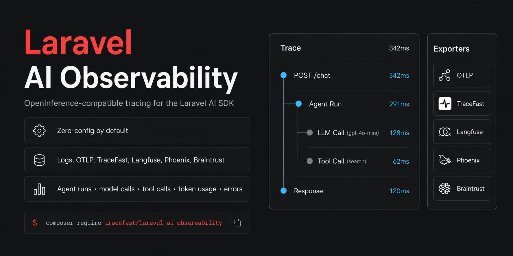

<p align="center">
    
</p>

# Laravel AI Observability

[](https://packagist.org/packages/tracefast/laravel-ai-observability)
[](https://packagist.org/packages/tracefast/laravel-ai-observability)
[](https://packagist.org/packages/tracefast/laravel-ai-observability)
[](LICENSE.md)

**OpenInference-compatible tracing for the [Laravel AI SDK](https://github.com/laravel/ai).**

This package listens to `laravel/ai` events and exports agent runs, model calls, tool calls, inputs, outputs, token usage, and errors — to your application logs, [TraceFast](https://tracefast.dev), Phoenix, Langfuse, Braintrust, any OTLP-compatible collector, or your local database.

It's designed to be safe to drop into a project on day one. Out of the box it writes structured traces to your existing Laravel log, makes no network calls, and exports through Laravel's deferred callback lifecycle wherever possible. When you're ready for a dedicated collector, switch exporters with a single environment variable.

---

## Table of Contents

- [Why this package](#why-this-package)
- [Requirements](#requirements)
- [Installation](#installation)
- [Quick Start](#quick-start)
- [Exporters](#exporters)
  - [TraceFast](#tracefast)
  - [Phoenix](#phoenix)
  - [Langfuse](#langfuse)
  - [Braintrust](#braintrust)
  - [Log](#log)
  - [Generic OTLP](#generic-otlp)
  - [Database](#database-exporter)
- [Content Capture](#content-capture)
- [Conversation Correlation](#conversation-correlation)
- [Advanced Configuration](#advanced-configuration)
  - [Production Transport Hardening](#production-transport-hardening)
- [Custom Exporters](#custom-exporters)
- [Testing](#testing)
- [Security](#security)
- [Contributing](#contributing)
- [License](#license)

---

## Why this package

- **Zero-config by default** — install and start capturing traces immediately; no collector, API key, or extra setup required.
- **OpenInference-compatible** — traces follow the OpenInference schema and `gen_ai.*` semantic conventions, so they work with the broader LLM observability ecosystem.
- **Production-safe export modes** — defer, queue, or background exports so trace delivery never sits in the critical request path.
- **Pluggable exporters** — ship traces to one or more destinations (TraceFast, Phoenix, Langfuse, Braintrust, generic OTLP, your database, or a custom driver) without changing application code.
- **Built-in resilience** — payload limits, bounded retries, gzip compression, and a circuit breaker protect your app if a collector is slow or unreachable.

## Requirements

| Requirement | Version |
| --- | --- |
| PHP | 8.4+ |
| Laravel | 12 or 13 |
| `laravel/ai` | ^0.7 |

## Installation

Install the package via Composer:

```bash
composer require tracefast/laravel-ai-observability
```

That's it — Observability is enabled by default and writes traces to your Laravel log.

To customize exporters or other settings, publish the config file:

```bash
php artisan vendor:publish --tag=ai-observability-config
```

## Quick Start

The default exporter is `log`, which requires no further configuration:

```env
# Optional — this is the default.
AI_OBSERVABILITY_EXPORTER=log
```

> **Note:** V1 captures full LLM input and output by default. See [Content Capture](#content-capture) to disable this.

For production deployments sending traces to a remote collector, keep the default `defer` export mode, or move exports to `queue` or `background` so trace delivery never blocks the request lifecycle. See [Advanced Configuration](#advanced-configuration).

## Exporters

Set `AI_OBSERVABILITY_EXPORTER` to a single exporter:

```env
AI_OBSERVABILITY_EXPORTER=phoenix
```

Or send traces to multiple destinations at once:

```env
AI_OBSERVABILITY_EXPORTER=tracefast,braintrust
```

### TraceFast

```env
AI_OBSERVABILITY_EXPORTER=tracefast
TRACEFAST_API_KEY=<tracefast-project-api-key>
```

The TraceFast endpoint defaults to `https://collector.tracefast.dev/v1/traces`. Override it only if TraceFast provides a custom collector URL:

```env
TRACEFAST_OTEL_ENDPOINT=https://collector.tracefast.dev/v1/traces
```

TraceFast uses `tracefast.platform` to identify the **integration or runtime family** — not your application. This package sends `laravel-ai` by default, allowing TraceFast to group these traces separately from `livekit`, `pipecat`, generic OpenInference, and other sources. Your application name remains in `service.name`, which defaults to `config('app.name')`.

```env
# Optional. Keep this as laravel-ai unless you intentionally publish a separate
# integration family.
AI_OBSERVABILITY_PLATFORM=laravel-ai
```

For example, a chatbot running inside a Laravel app named `Acme Support` should keep `tracefast.platform=laravel-ai` and `service.name=Acme Support`. Don't put the chatbot, tenant, or product name in `AI_OBSERVABILITY_PLATFORM` — add that context with [scoped attributes](#conversation-correlation) instead.

### Phoenix

```env
AI_OBSERVABILITY_EXPORTER=phoenix
PHOENIX_COLLECTOR_ENDPOINT=http://localhost:6006/v1/traces
```

### Langfuse

```env
AI_OBSERVABILITY_EXPORTER=langfuse
LANGFUSE_OTEL_ENDPOINT=https://cloud.langfuse.com/api/public/otel/v1/traces
LANGFUSE_OTEL_AUTHORIZATION="Basic <base64-public-key-colon-secret-key>"
```

### Braintrust

```env
AI_OBSERVABILITY_EXPORTER=braintrust
BRAINTRUST_API_KEY=<braintrust-api-key>
BRAINTRUST_PARENT=project_name:<project-name>
```

The Braintrust endpoint defaults to `https://api.braintrust.dev/otel/v1/traces`.

### Log

```env
AI_OBSERVABILITY_EXPORTER=log
```

Advanced log options:

```env
AI_OBSERVABILITY_LOG_CHANNEL=stack
AI_OBSERVABILITY_LOG_LEVEL=debug
```

### Generic OTLP

For Laravel apps that run `php artisan optimize` or otherwise cache config, prefer the package-specific variables so the endpoint and headers are baked into Laravel's cached config:

```env
AI_OBSERVABILITY_EXPORTER=otlp
AI_OBSERVABILITY_OTLP_ENDPOINT=https://collector.example.com/v1/traces
AI_OBSERVABILITY_OTLP_HEADERS="Authorization=Bearer <token>"
```

The package also honors standard OTEL environment variables when they're available as real process environment variables. As of v1.1.1, these are also bridged through Laravel's config when present in `.env` during config caching:

```env
AI_OBSERVABILITY_EXPORTER=otlp
OTEL_EXPORTER_OTLP_TRACES_ENDPOINT=https://collector.example.com/v1/traces
OTEL_EXPORTER_OTLP_TRACES_HEADERS="Authorization=Bearer <token>"
```

OTLP payloads include OpenInference and versioned TraceFast metadata, such as `openinference.schema.version`, `tracefast.ai.sdk.version`, `tracefast.ai.package.version`, and `gen_ai.*` attributes where the Laravel AI SDK exposes the source data.

### Database Exporter

The database exporter is opt-in and stores traces directly in your application's database.

```bash
php artisan vendor:publish --tag=ai-observability-migrations
php artisan migrate
```

```env
AI_OBSERVABILITY_EXPORTER=database
```

Use a specific connection when needed:

```env
AI_OBSERVABILITY_DB_CONNECTION=mysql
```

The migration creates two tables: `ai_observability_traces` and `ai_observability_spans`.

## Content Capture

By default, this package captures full input and output. This may include prompts, system messages, tool arguments, tool results, uploaded content, PII, secrets, and other sensitive business data.

To disable content capture:

```env
AI_OBSERVABILITY_CAPTURE_CONTENT=off
```

## Conversation Correlation

Use `AiObservability::withSession()` when your application has its own conversation ID:

```php
use Tracefast\LaravelAiObservability\Facades\AiObservability;

$response = AiObservability::withSession(
    sessionId: $conversation->uuid,
    callback: fn () => $agent->prompt($message),
    userId: $user->id,
    attributes: [
        'tenant.id' => (string) $tenant->id,
        'workflow.name' => 'support-triage',
    ],
);
```

Each turn remains its own trace, and every turn carries the same `session.id`. Scoped attributes are copied onto the agent, LLM, and tool spans created while the callback runs. Use them for app-specific business context such as tenant IDs, workflow names, plan names, feature flags, experiment IDs, or your existing conversation ID.

If you don't need the `session.id` or `user.id` helpers, use `AiObservability::withAttributes()` instead:

```php
$response = AiObservability::withAttributes([
    'tenant.id' => (string) $tenant->id,
    'workflow.name' => 'support-triage',
], fn () => $agent->prompt($message));
```

Keep scoped attributes separate from resource identity:

- `tracefast.platform` identifies the **integration family**
- `service.name` identifies the **Laravel app or service**
- Custom attributes identify the **business context** for a specific trace or span

## Advanced Configuration

```env
AI_OBSERVABILITY_ENABLED=true
AI_OBSERVABILITY_EXPORT_MODE=defer
AI_OBSERVABILITY_SAMPLE_RATE=1.0
AI_OBSERVABILITY_EXPORT_TIMEOUT=2.0
AI_OBSERVABILITY_EXPORT_CONNECT_TIMEOUT=0.5
AI_OBSERVABILITY_MAX_PAYLOAD_BYTES=1048576
```

`AI_OBSERVABILITY_EXPORT_MODE` accepts `defer`, `sync`, `queue`, or `background`:

| Mode | Behavior |
| --- | --- |
| `defer` *(default)* | Exports after the response is sent, when Laravel can defer work. Also runs at command and queue job boundaries via Laravel's deferred callback lifecycle. |
| `sync` | Exports immediately, in line with the request. |
| `queue` | Hands off exports to a normal queue worker. |
| `background` | Releases the current PHP worker quickly via a dedicated `background` queue connection. |

Use `queue` when you want exports handled by a normal queue worker:

```env
AI_OBSERVABILITY_EXPORT_MODE=queue
AI_OBSERVABILITY_EXPORT_CONNECTION=redis
AI_OBSERVABILITY_EXPORT_QUEUE=observability
```

Use `background` when your Laravel app has a `background` queue connection and you want to release the current PHP worker quickly:

```env
AI_OBSERVABILITY_EXPORT_MODE=background
```

### Production Transport Hardening

```env
AI_OBSERVABILITY_EXPORT_TIMEOUT=2.0
AI_OBSERVABILITY_EXPORT_CONNECT_TIMEOUT=0.5
AI_OBSERVABILITY_MAX_PAYLOAD_BYTES=1048576
AI_OBSERVABILITY_EXPORT_RETRY_ATTEMPTS=1
AI_OBSERVABILITY_EXPORT_RETRY_DELAY_MS=100
AI_OBSERVABILITY_OTLP_COMPRESSION=gzip
AI_OBSERVABILITY_CIRCUIT_BREAKER=true
AI_OBSERVABILITY_CIRCUIT_BREAKER_FAILURE_THRESHOLD=3
AI_OBSERVABILITY_CIRCUIT_BREAKER_OPEN_SECONDS=30
```

- Payloads larger than `AI_OBSERVABILITY_MAX_PAYLOAD_BYTES` are dropped and reported locally instead of being sent.
- OTLP retries are bounded and only intended for transient collector failures (network errors, `408`, `425`, `429`, and `5xx` responses).
- The circuit breaker skips sends for a short window after repeated failures, so a dead collector doesn't keep taxing request workers.

## Custom Exporters

Implement the `Exporter` contract to send traces anywhere:

```php
use Tracefast\LaravelAiObservability\Contracts\Exporter;
use Tracefast\LaravelAiObservability\Data\Trace;

final class WebhookExporter implements Exporter
{
    public function export(Trace $trace): void
    {
        // Send $trace->toArray() to your destination.
    }
}
```

Register the driver from a service provider:

```php
use App\Observability\WebhookExporter;
use Illuminate\Contracts\Foundation\Application;
use Illuminate\Support\ServiceProvider;
use Tracefast\LaravelAiObservability\AiObservability;
use Tracefast\LaravelAiObservability\Contracts\Exporter;

final class AppServiceProvider extends ServiceProvider
{
    public function boot(AiObservability $observability): void
    {
        $observability->extend(
            'webhook',
            fn (Application $app, array $config, string $name): Exporter => new WebhookExporter(),
        );
    }
}
```

Then configure it:

```php
'exporters' => [
    'webhook' => [
        'driver' => 'webhook',
    ],
],
```

## Testing

```bash
composer test
```

## Security

If you discover a security vulnerability, please report it responsibly rather than opening a public issue. See [SECURITY.md](SECURITY.md) for details.

## Contributing

Contributions are welcome. Please see [CONTRIBUTING.md](CONTRIBUTING.md) for details on submitting issues and pull requests.

## License

Laravel AI Observability is open-sourced software licensed under the [MIT license](LICENSE.md).
